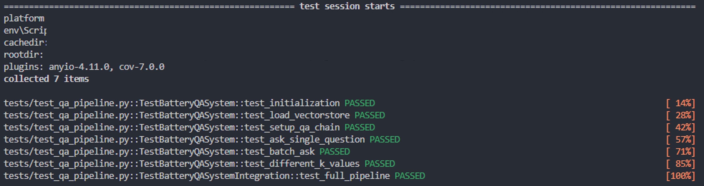
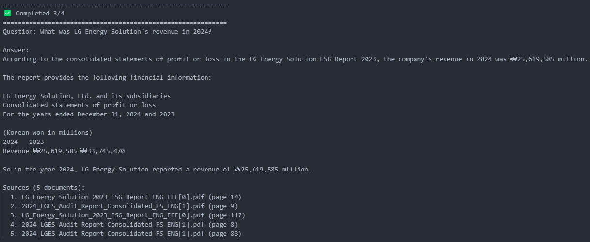

# bedrock-rag-qa

## TL;DR

A question-answering system that leverages AWS Bedrock (Claude 3 Haiku & Titan Embeddings) and LangChain to answer queries about LG Energy Solution's battery technology, product specifications, and sustainability practices.

**Tech Stack**: AWS Bedrock, Claude 3 Haiku, Titan Embeddings, LangChain, FAISS, Python

## Project Overview

This project demonstrates:
- Document ingestion and chunking from PDF files
- Vector embeddings using Amazon Titan
- Semantic search with FAISS
- LLM-powered Q&A with Claude 3 Haiku
- RAG (Retrieval-Augmented Generation) pipeline

## ⚠️ IMPORTANT: Legal & Data Compliance Notice

**ALL documents in this project are from PUBLICLY AVAILABLE sources ONLY:**

| Source | Type | Access |
|--------|------|--------|
| **LG Energy Solution Official Website** | ESG Reports, IR Materials | Public ([www.lgensol.com](https://www.lgensol.com/en/index)) |

### What This Project Does NOT Include

- ❌ Internal company documents
- ❌ Confidential information
- ❌ Proprietary technical data

**Not affiliated with, endorsed by, or sponsored by LG Energy Solution.**

## Project Structure
```text
bedrock-rag-qa/v1-prototype/
├── assets/
│   ├── answer_example.png
│   └── test_result.png
├── data/raw/
│   └── *.pdf                     # Original PDF files
├── examples/
│   └── qa_testing.ipynb          # Interactive testing notebook
├── src/
│   ├── __init__.py
│   ├── bedrock_client.py         # Bedrock client manager
│   ├── data_ingestion.py         # Document loading & chunking
│   └── qa_pipeline.py            # QA main pipeline
├── tests/
│   ├── __init__.py
│   └── test_qa_pipeline.py
├── requirements.txt
└── README.md
```

## Architecture
```text
┌─────────────────────────────────────────────────────────────┐
│                    OFFLINE (One-time Setup)                 │
└─────────────────────────────────────────────────────────────┘

┌──────────────────┐
│  PDF Documents   │
│  (377 pages)     │
└────────┬─────────┘
         │ PyPDF
         ▼
┌──────────────────┐
│  Text Chunking   │
│  1000 chars      │
│  200 overlap     │
└────────┬─────────┘
         │ 1,397 chunks
         ▼
┌──────────────────┐      ┌─────────────────────┐
│  AWS Bedrock     │─────▶│  FAISS Vectorstore  │
│  Titan Embedding │      │  (Local Cache)      │
│  $0.14 one-time  │      │  1536-dim vectors   │
└──────────────────┘      └─────────────────────┘


┌─────────────────────────────────────────────────────────────┐
│                    ONLINE (Query Processing)                │
└─────────────────────────────────────────────────────────────┘

┌──────────────────┐
│  User Question   │
└────────┬─────────┘
         │
         ▼
┌──────────────────┐      ┌─────────────────────┐
│  AWS Bedrock     │      │  FAISS Vectorstore  │
│  Titan Embedding │─────▶│  Similarity Search  │
│  (per query)     │      │  Top-k = 3          │
└──────────────────┘      └────────┬────────────┘
                                   │
                  ┌────────────────┘
                  │ Retrieved Documents
                  ▼
         ┌────────────────────┐
         │  Prompt Template   │
         │  Context + Query   │
         └────────┬───────────┘
                  │
                  ▼
         ┌────────────────────┐
         │  AWS Bedrock       │
         │  Claude 3 Haiku    │
         │  $0.0005/query     │
         └────────┬───────────┘
                  │
                  ▼
         ┌────────────────────┐
         │  Final Answer      │
         │  + Source Docs     │
         └────────────────────┘
```
## 🚀 Quick Start

### Prerequisites

- Python 3.9+
- AWS Account with Bedrock access
- AWS CLI configured

### 1. Clone and Navigate

```bash
cd /path/to/bedrock-rag-qa
```

### 2. Create Virtual Environment

```bash
# Create virtual environment
python3 -m venv venv

# Activate
source venv/bin/activate
```

### 3. Install Dependencies

```bash
pip install -r requirements.txt
pre-commit install
```

### 4. Configure Environment

Create `.env` file:

```bash
cat > .env << 'EOF'
AWS_REGION=us-east-1
AWS_PROFILE=default
EMBEDDING_MODEL=amazon.titan-embed-text-v1
LLM_MODEL=anthropic.claude-3-haiku-20240307-v1:0
EOF
```
You can change models in `.env`:

```bash
# Budget option (current)
LLM_MODEL=anthropic.claude-3-haiku-20240307-v1:0

# Higher quality (more expensive)
LLM_MODEL=anthropic.claude-3-5-sonnet-20240620-v1:0

# Amazon's model
LLM_MODEL=amazon.titan-text-express-v1
```

### 5. AWS Credentials

```bash
aws configure
# AWS Access Key ID: YOUR_KEY
# AWS Secret Access Key: YOUR_SECRET
# Default region name: us-east-1
# Default output format: json
```

### 6. Prepare Data

Place your PDF documents in the `data/raw/` directory:

```bash
# Check your PDF files
ls data/raw/
```

Expected structure:

```text
bedrock-rag-qa/
├── data/
│ ├── raw/ ─── *.pdf
│ └── embeddings/
```

## ✅ Testing

Comprehensive test suite covering core functionality:
```bash
pytest tests/test_qa_pipeline.py -v
```

Expected results:




**Test Coverage:**
- System initialization
- Vectorstore loading and persistence
- QA chain setup
- Single question answering
- Batch question processing
- Different retrieval parameters (k=1,2,3,5)
- Full pipeline integration test


## 📖 Usage Example

### Interactive Notebook
For detailed usage examples, see [`examples/qa_testing.ipynb`](examples/qa_testing.ipynb).

### Sample Q&A


## Performance Metrics

### System Specifications
- **Documents Processed:** 377 pages
- **Chunks Created:** 1,397 segments
- **Vector Dimension:** 1,536 (Titan Embeddings)
- **Vectorstore Size:** ~10 MB

### Response Times
| Operation | Time | Notes |
|-----------|------|-------|
| First-time vectorstore build | ~6 min | One-time setup |
| Vectorstore loading | <1 sec | Cached locally |
| Query response (k=3) | 4-5 sec | AWS Bedrock latency |
| Batch queries (k=3, 5 questions) | 4-5 sec | Parallel processing |

### Cost Estimate
| Service | Usage | Cost/Query | Cost/Month* |
|---------|-------|------------|-------------|
| Titan Embeddings | 1K tokens | ~$0.0001 | ~$0.10 |
| Claude 3 Haiku | 2K tokens | ~$0.0005 | ~$0.50 |
| **Total** | | **~$0.0006** | **~$0.60** |

*Based on 100 queries/day
