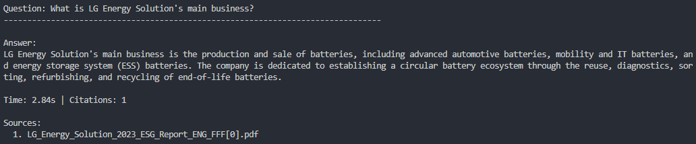

# bedrock-rag-qa-v2 🚀

Production-ready RAG system with AWS Bedrock Knowledge Base, OpenSearch Serverless, and comprehensive monitoring.

## TL;DR

An enterprise-grade question-answering system powered by AWS Bedrock Knowledge Base, OpenSearch Serverless, and Claude 3 Haiku. Fully automated document ingestion, vector indexing, and scalable infrastructure deployed via Terraform.

**Tech Stack**: AWS Bedrock Knowledge Base, OpenSearch Serverless, Claude 3 Haiku, Titan Embeddings, Terraform, Python

## What's New in v2.0

| Feature | v1.0 | v2.0 |
|---------|------|------|
| **Vector Store** | Local FAISS | OpenSearch Serverless |
| **Data Management** | Manual upload | S3 auto-sync + versioning |
| **Knowledge Base** | Custom implementation | AWS Bedrock Knowledge Base |
| **Monitoring** | None | CloudWatch + Metrics + Alerts |
| **Infrastructure** | Manual setup | Terraform IaC |
| **Scalability** | Single machine | Auto-scaling serverless |
| **Cost** | ~$0.60/month | ~$5-10/month (production) |
| **Deployment** | Local only | Cloud-native |

## ⚠️ IMPORTANT: Legal & Data Compliance Notice

**ALL documents in this project are from PUBLICLY AVAILABLE sources ONLY:**

| Source | Type | Access |
|--------|------|--------|
| **LG Energy Solution Official Website** | ESG Reports, IR Materials | Public ([www.lgensol.com](https://www.lgensol.com/en/index)) |

### What This Project Does NOT Include

- ❌ Internal company documents
- ❌ Confidential information
- ❌ Proprietary technical data

**Not affiliated with, endorsed by, or sponsored by LG Energy Solution.**

## Project Structure

```text
bedrock-rag-qa/v2-production/
├── assets/
│   └── answer_example.png
├── examples/
│   └── qa_testing.ipynb          # Interactive testing notebook
├── src/
│   ├── __init__.py
│   ├── bedrock_kb_client.py      # Bedrock KB client
│   ├── config.py                 # Configuration management
│   ├── logger.py                 # CloudWatch logging
│   └── qa_pipeline.py            # Production QA pipeline
├── terraform/
│   ├── main.tf                   # AWS provider config
│   ├── variable.tf               # Variables
│   ├── s3.tf                     # S3 bucket for documents
│   ├── iam.tf                    # IAM roles & policies
│   ├── opensearch.tf             # OpenSearch Serverless
│   ├── kb.tf                     # Bedrock Knowledge Base
│   ├── cloudwatch.tf             # Monitoring & alerts
│   ├── outputs.tf                # Output values
│   └── README.md                 # Terraform documentation
├── tests/
│   ├── __init__.py
│   └── test_qa_pipeline.py
├── requirements.txt
└── README.md
```

## Architecture

```text
┌─────────────────────────────────────────────────────────────┐
│                    AWS Infrastructure                       │
└─────────────────────────────────────────────────────────────┘

PDF Files (Local)
    ↓ (upload)
┌──────────────────┐
│  S3 Bucket       │ ← Versioning + Lifecycle
│  (documents)     │
└────────┬─────────┘
         │
         ▼
┌──────────────────────────────────────┐
│  Bedrock Knowledge Base              │
│  - Auto PDF parsing                  │
│  - Chunking (300 tokens, 20% overlap)│
│  - Titan Embeddings v1               │
└────────┬─────────────────────────────┘
         │
         ▼
┌──────────────────────────────────────┐
│  OpenSearch Serverless               │
│  - Vector search (1536-dim)          │
│  - Auto-scaling                      │
└──────────────────────────────────────┘
         │
         ▼
┌──────────────────────────────────────┐
│  Claude 3 Haiku                      │
│  - Answer generation                 │
└──────────────────────────────────────┘
         │
         ▼
┌──────────────────────────────────────┐
│  CloudWatch                          │
│  - Logs + Metrics + Dashboard        │
└──────────────────────────────────────┘
```

## 🚀 Quick Start

### Prerequisites

- Python 3.9+
- AWS Account with Bedrock access
- AWS CLI configured
- Terraform 1.0+

### 1. Clone and Navigate

```bash
cd /path/to/bedrock-rag-qa/v2-production
```

### 2. Create Virtual Environment

```bash
# Create virtual environment
python3 -m venv venv

# Activate
source venv/bin/activate
```

### 3. Install Dependencies

```bash
pip install -r requirements.txt
```

### 4. Configure AWS Credentials

```bash
# Configure AWS CLI
aws configure
# AWS Access Key ID: YOUR_KEY
# AWS Secret Access Key: YOUR_SECRET
# Default region name: us-west-2
# Default output format: json

# Verify access
aws sts get-caller-identity
```

### 5. Set Up IAM Permissions

Attach these policies to your IAM user:

```bash
USER_NAME="your-iam-user"

# Attach managed policies
aws iam attach-user-policy --user-name $USER_NAME \
  --policy-arn arn:aws:iam::aws:policy/AmazonBedrockFullAccess

aws iam attach-user-policy --user-name $USER_NAME \
  --policy-arn arn:aws:iam::aws:policy/AmazonOpenSearchServiceFullAccess

aws iam attach-user-policy --user-name $USER_NAME \
  --policy-arn arn:aws:iam::aws:policy/AmazonS3FullAccess

aws iam attach-user-policy --user-name $USER_NAME \
  --policy-arn arn:aws:iam::aws:policy/AmazonSageMakerFullAccess

aws iam attach-user-policy --user-name $USER_NAME \
  --policy-arn arn:aws:iam::aws:policy/CloudWatchFullAccess

aws iam attach-user-policy --user-name $USER_NAME \
  --policy-arn arn:aws:iam::aws:policy/IAMFullAccess

# Add OpenSearch Serverless inline policy
aws iam put-user-policy --user-name $USER_NAME \
  --policy-name OpenSearchServerlessFullAccess \
  --policy-document '{
    "Version": "2012-10-17",
    "Statement": [{
      "Effect": "Allow",
      "Action": "aoss:*",
      "Resource": "*"
    }]
  }'
```

### 6. Request Bedrock Model Access

1. Go to: https://console.aws.amazon.com/bedrock/
2. Navigate to: **Model catalog**
3. Select models: Claude 3 Haiku (or Claude 3.5 Sonnet)
5. Submit request (usually instant approval)

### 7. Deploy Infrastructure with Terraform

For detail, [View terraform documentation →](./terraform/README.md)

```bash
cd terraform

# Initialize Terraform
terraform init

# Preview changes
terraform plan

# Deploy infrastructure
terraform apply
# Type: yes

# Wait 10-15 minutes for deployment
```

### 8. Import Existing Resources (If Needed)

If you already have resources deployed, import them:

```bash
# List existing resources
aws bedrock-agent list-knowledge-bases --region us-west-2
aws bedrock-agent list-data-sources --knowledge-base-id <KB_ID> --region us-west-2
aws opensearchserverless list-collections --region us-west-2

# Import Knowledge Base
terraform import aws_bedrockagent_knowledge_base.main <KNOWLEDGE_BASE_ID>

# Import OpenSearch Collection
terraform import aws_opensearchserverless_collection.vectors <COLLECTION_ID>

# Import other resources as needed
terraform import aws_s3_bucket.documents <BUCKET_NAME>
terraform import aws_iam_role.bedrock_kb <ROLE_NAME>
terraform import aws_cloudwatch_log_group.app_logs <LOG_GROUP_NAME>

# Apply to sync state
terraform apply
```

### 9. Get Terraform Outputs

```bash
# Get all outputs
terraform output

# Save to file
terraform output > ../terraform_outputs.txt

# Get specific values
terraform output knowledge_base_id
terraform output data_source_id
terraform output s3_bucket_name
```

### 10. Configure Environment Variables

Create `.env` file in `v2-production/` directory.
Replace values with your Terraform outputs.

```bash
cat > .env << 'EOF'
AWS_REGION=us-west-2
KNOWLEDGE_BASE_ID=<your-kb-id>
DATA_SOURCE_ID=<your-data-source-id>
S3_BUCKET=<your-bucket-name>
LOG_GROUP=/aws/bedrock-rag-qa-v2-west/application
EOF
```

### 11. Upload Documents to S3

```bash
# Upload PDF files from v1-prototype data
aws s3 sync ../v1-prototype/data/raw s3://<your-bucket-name>/documents/ --region us-west-2

# Verify upload
aws s3 ls s3://<your-bucket-name>/documents/ --recursive --region us-west-2
```

### 12. Sync Knowledge Base

```bash
# Start ingestion job
aws bedrock-agent start-ingestion-job \
  --knowledge-base-id <your-kb-id> \
  --data-source-id <your-data-source-id> \
  --region us-west-2

# Check sync status
aws bedrock-agent list-ingestion-jobs \
  --knowledge-base-id <your-kb-id> \
  --data-source-id <your-data-source-id> \
  --region us-west-2 \
  --max-results 5

# Wait 3-5 minutes for completion
```

### 13. Verify Configuration

```bash
# Test configuration
python src/config.py

# Expected output:
# Loaded .env from: /path/to/.env
# Configuration loaded successfully
```

## 📖 Usage Examples

### Command Line

```bash
# Run QA pipeline
python src/qa_pipeline.py
```

### Interactive Notebook

For detailed usage examples, see [`examples/qa_testing.ipynb`](examples/qa_testing.ipynb).


### Sample Q&A



## Performance Metrics

### System Specifications

- **Documents Processed:** 377 pages (4 PDF files)
- **Vector Store:** OpenSearch Serverless
- **Vector Dimension:** 1,536 (Titan Embeddings)
- **Chunking Strategy:** Fixed size (300 tokens, 20% overlap)
- **Retrieval:** Top-5 most relevant chunks

### Response Times

| Operation | Time | Notes |
|-----------|------|-------|
| Infrastructure deployment | ~10-15 min | One-time Terraform apply |
| Document ingestion | ~3-5 min | Knowledge Base sync |
| Query response (k=5) | 2-3 sec | AWS Bedrock latency |
| Batch queries (5 questions) | 3-4 sec | Parallel processing |

### Cost Estimate

| Service | Usage | Cost/Query | Cost/Month* |
|---------|-------|------------|-------------|
| OpenSearch Serverless | 2 OCU | - | ~$3-4 |
| Bedrock KB Storage | Vector index | - | ~$0.50 |
| Titan Embeddings | 1K tokens | ~$0.0001 | ~$0.30 |
| Claude 3 Haiku | 2K tokens | ~$0.0005 | ~$1.50 |
| CloudWatch Logs | 10GB | - | ~$0.50 |
| S3 Storage | 15MB | - | ~$0.01 |
| **Total** | | **~$0.0006** | **~$5-8** |

*Based on 100 queries/day

## ✅ Testing

```bash
# Run tests
pytest tests/test_qa_pipeline.py -v

# Expected coverage:
# - System initialization
# - Configuration loading
# - Knowledge Base connection
# - Single question answering
# - Batch question processing
# - Error handling
```

## Cleanup

To destroy all AWS resources:

```bash
cd terraform

# Destroy infrastructure
terraform destroy
# Type: yes

# This will delete:
# - OpenSearch Serverless collection
# - Bedrock Knowledge Base & Data Source
# - S3 bucket (if empty)
# - IAM roles & policies
# - CloudWatch logs & alarms
```

## 🐛 Troubleshooting

### Common Issues

#### 1. Terraform Import Errors

**Problem:** `Resource already exists` errors during `terraform apply`

**Solution:** Import existing resources before applying:

```bash
# List resources
terraform state list

# Import missing resources
terraform import aws_bedrockagent_knowledge_base.main <KB_ID>
terraform import aws_opensearchserverless_collection.vectors <COLLECTION_ID>
```

#### 2. S3 File Structure Issues

**Problem:** Files uploaded to wrong S3 path

**Solution:** Clean up and reorganize:

```bash
# Remove duplicate files
aws s3 rm s3://<bucket>/documents/raw/ --recursive --region us-west-2

# Keep only files in documents/ root
aws s3 ls s3://<bucket>/documents/ --recursive --region us-west-2
```

#### 3. Knowledge Base Returns No Results

**Problem:** `Citations: 0` and generic answers

**Solution:** Ensure Knowledge Base is synced:

```bash
# Check Data Source ID
aws bedrock-agent list-data-sources --knowledge-base-id <KB_ID> --region us-west-2

# Update .env with correct DATA_SOURCE_ID
# Start sync
aws bedrock-agent start-ingestion-job \
  --knowledge-base-id <KB_ID> \
  --data-source-id <DATA_SOURCE_ID> \
  --region us-west-2

# Wait 3-5 minutes and test again
```

## Security Best Practices

- Store AWS credentials securely (use AWS IAM roles in production)
- Enable S3 bucket versioning for document history
- Use CloudWatch for monitoring and alerting
- Follow principle of least privilege for IAM policies
- Never commit `.env` or credentials to version control